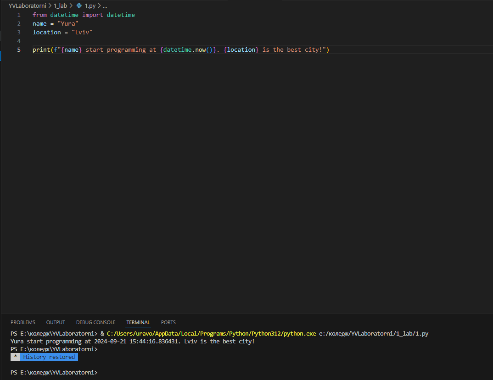
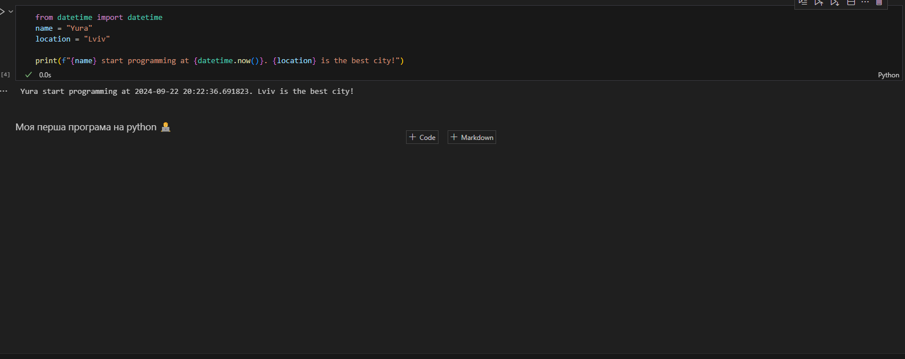
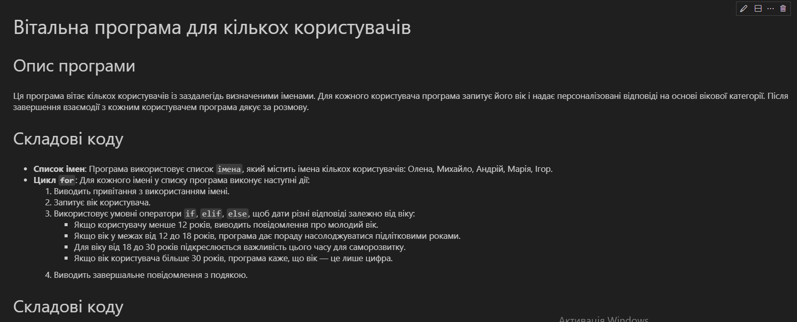

# Звіт до роботи
## Тема: Оформлення та здача робіт
### Мета роботи: навчитися оформляти звіт

---
### Виконання роботи
*   Виконання завдань ;
    1. Створив свою першу програму на python  [програма](1.py)    результат;
    1. Оформив програму у серидовищі note book  [програма](1.ipynb) результат;
    1. Виконав індивідуальне завдання;
    1. Навчився оформляти звіт,комітити файли в свій репозиторій,базово працювати в visual studio code;

* 

* результати виконання індивідуального завдання (якщо такі є);
    1. Зпитав в chat gpt як б першу цікаву програму на python він створив б;
    1. код ;
    1. Опис у форматі markdown ;
    1. [note book python](ind.ipynb);
*  
---
### Висновок:
> у висновку потрібно відповісти на запитання:

- :question: Що зроблено в роботі;
 зроблено програму на pyhthon; 
 офомлено прогрму у форматі файлу py та python norebook;
 виконано індивідуальне завдання;
- :question: Чи досягнуто мети роботи;
Так✅
- :question: Які нові знання отримано;
- знання про те як робити посилання на локально най файл програми і картинки;
- :question: Чи вдалось відповісти на всі питання задані в ході роботи;
- так.
- :question: Чи вдалося виконати всі завдання;
- так.
- :question: Чи виникли складності у виконанні завдання;
- ні.
- :question: Чи подобається такий формат здачі роботи (Feedback);
- так. 
- :question: Побажання для покращення (Suggestions);

---