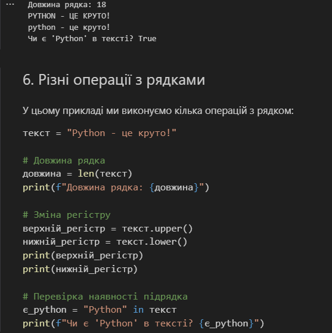
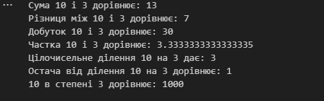

# Звіт до роботи
## Тема: Робота з основними конструкціями в python 
### Мета роботи: навчитись виконувати арифметичні дії в python

---
### Виконання роботи
*   #### Завдання 1;
    1. Створив  програму на python  [програма прості стрічки в python](1py.ipynb);
    1. Результат виконання програми ;

* 

*   Завдання 2;
    1. Створив  програму на python  [програма арифметичні дії в pathon](2py.ipynb);
    1. Результат виконання програми ; 
* 
* Завдання 3;

*  
* Завдання 4;

*  
* Завдання 5;

* 
* Завдання 6;

*    
---
### Висновок:
> у висновку потрібно відповісти на запитання:

- :question: Що зроблено в роботі;
написана програма з різними операціями з рядками.
- :question: Чи досягнуто мети роботи;
Так✅
- :question: Які нові знання отримано;
- 
- :question: Чи вдалось відповісти на всі питання задані в ході роботи;
- так.
- :question: Чи вдалося виконати всі завдання;
- так.
- :question: Чи виникли складності у виконанні завдання;
- ні.
- :question: Чи подобається такий формат здачі роботи (Feedback);
- нормально. 
- :question: Побажання для покращення (Suggestions);
- немає.
---