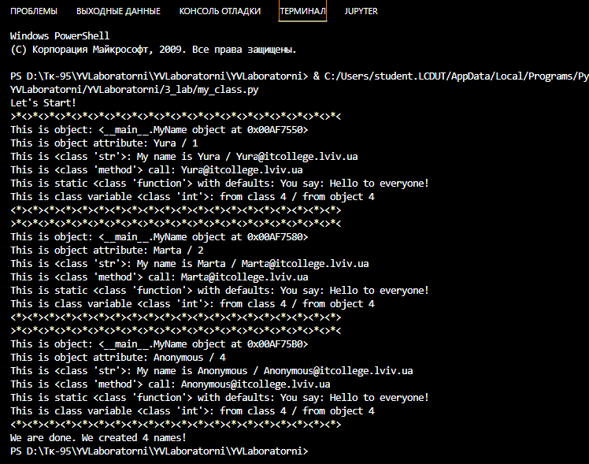

# Звіт до роботи
## Тема: Знайомство з ООП
### Мета роботи: познайомитись з ооп створити свій перший class попрактикуватись з прикладами

---
### Виконання роботи
*  
    ### Завдання;
	 1Виконати код  [файл з виконаним завданням](1.py);
    результат виконання ;

*    
---
### Висновок:
- :question: Що зроблено в роботі;
Попрацьовано з основими контсрукціями в payton
- :question: Чи досягнуто мети роботи;
Так✅
- :question: Які нові знання отримано;
- знання про class.
- :question: Чи вдалось відповісти на всі питання задані в ході роботи;
- так.
- :question: Чи вдалося виконати всі завдання;
- так.
- :question: Чи виникли складності у виконанні завдання;
- ні.
- :question: Чи подобається такий формат здачі роботи (Feedback);
- так. 
- :question: Побажання для покращення (Suggestions);
- немає.
---